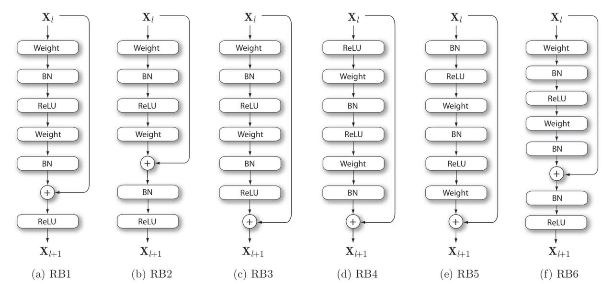
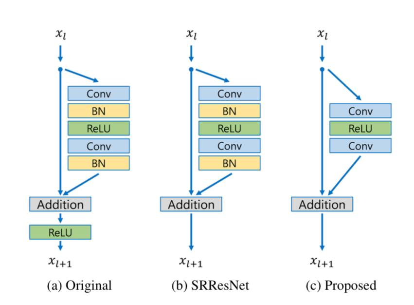
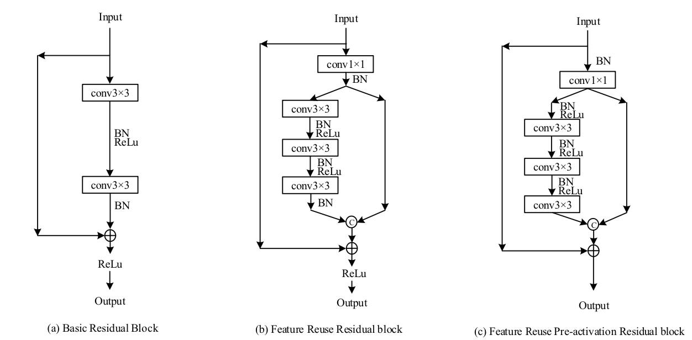
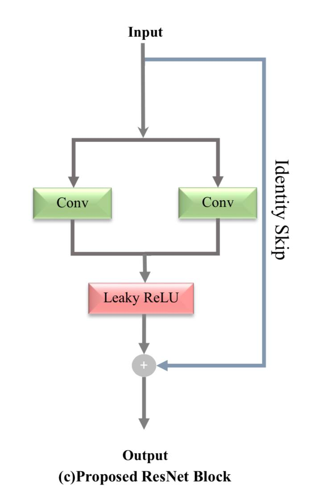

# ResNet-block-factory
 a keras implementation of diffrent residual blocks

# REFERENCES
https://arxiv.org/pdf/1512.03385.pdf
https://arxiv.org/pdf/1906.10891.pdf
https://arxiv.org/abs/1707.02921
https://ieeexplore.ieee.org/document/8819933
https://www.researchgate.net/figure/The-comparison-of-residual-blocks-in-ResNet-SRResNet-and-our-proposed-ResNet_fig1_353973396
